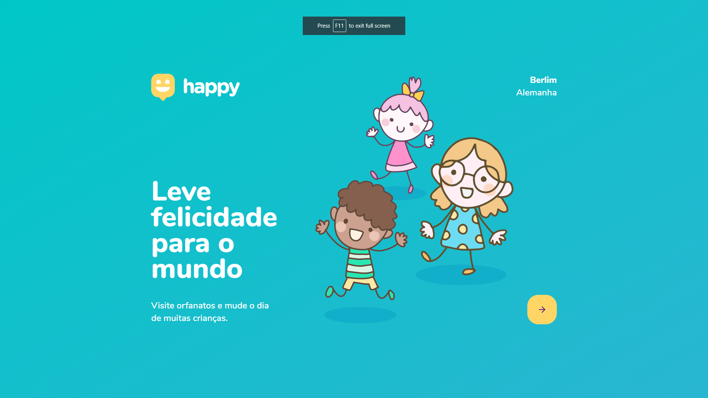
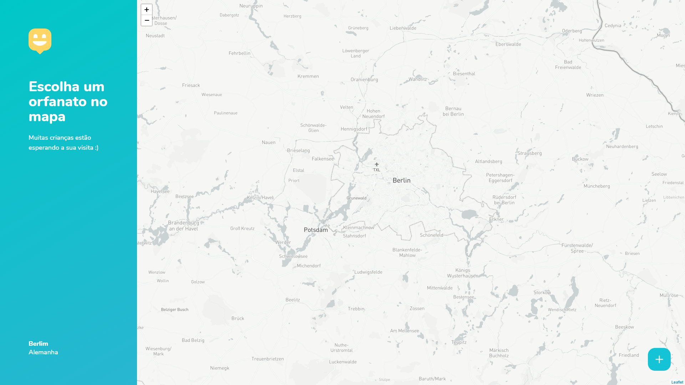

<!-- [](https://gitpod.io/#https://github.com/marcelosperalta/mock-up_e-learning_platform) -->

# "Happy" - Orphanage finder  

A platform to find orphanages to visit built with **[HTML](https://whatwg.org/)**, **[CSS](https://www.w3.org/Style/CSS/)**, **[JavaScript](https://developer.mozilla.org/en-US/docs/Web/JavaScript)**, **[TypeScript](https://www.typescriptlang.org/)**, **[React](https://reactjs.org/)**, **[Node.js](https://nodejs.org/)**, **[Express.js](https://expressjs.com/)**, and **[SQLite](https://www.sqlite.org/)**.  

<br>

<div align="center">
    
    
    &nbsp;
    
    &nbsp;
    &nbsp;
    
    &nbsp;
    
    &nbsp;
    
    &nbsp;
    
        &nbsp;
    
</div>

<br>

## :mortar_board: **_bootcamp:_**  

### [Rocketseat](https://rocketseat.com.br/)

#### [Next Level Week #3](https://nextlevelweek.com/)

*OmniStack* with [Diego Fernandes](https://github.com/diego3g)  


<br>

## :camera: **_screenshots:_**  

### :iphone:  

  

### :computer:  

  

  
<br>

## :fire: **_Source code editor_**  

[Visual Studio Code](https://code.visualstudio.com/)  
<br>

## :wrench: **_tools "Front-end":_**  

[Figma](https://www.figma.com/)  

[React Icons](https://react-icons.github.io/react-icons/)  

[React Router](https://reactrouter.com/web/guides/quick-start)  

[Leaflet](https://leafletjs.com/)  

[React Leaflet](https://react-leaflet.js.org/)  

[OpenStreetMap](https://www.openstreetmap.org/)  

[mapbox](https://www.mapbox.com/)  

[Google Maps Platform](https://cloud.google.com/maps-platform)  
<br>

## :hammer: **_tools "Back-end":_**  

[Node.js](https://nodejs.org/en/)  

[npm](https://docs.npmjs.com/)  

[yarn](https://yarnpkg.com/)  

[Expo CLI](https://docs.expo.io/workflow/expo-cli/?redirected)  

[Express](https://expressjs.com/)  

[Chrome Extension "JSON Viewer"](https://chrome.google.com/webstore/detail/json-viewer/gbmdgpbipfallnflgajpaliibnhdgobh)  

[Insomnia](https://insomnia.rest/)  

[TypeORM](https://typeorm.io/)  

[SQLite](https://www.sqlite.org/)  
<br>
<!-- [Visual Studio Code Extension "SQLite"](https://marketplace.visualstudio.com/items?itemName=alexcvzz.vscode-sqlite)   -->

<!-- [Express.js](https://expressjs.com/)  

[Nunjucks](https://mozilla.github.io/nunjucks/)  

[Git Bash](https://gitforwindows.org/)   -->

## :books: **_important topics:_**  

### Front-end

[Representational state transfer (REST)](https://en.wikipedia.org/wiki/Representational_state_transfer)  

[JSON](https://www.json.org/)  

[Observer pattern](https://en.wikipedia.org/wiki/Observer_pattern#Uncoupled)  

[Single-page application (SPA)](https://en.wikipedia.org/wiki/Single-page_application)  

[Babel](https://babeljs.io/)  

[Hot Reloading](https://reactnative.dev/blog/2016/03/24/introducing-hot-reloading.html#hot-reloading)  

[Fast Refresh](https://reactnative.dev/docs/fast-refresh)  

### Back-end

[HTTP request methods](https://developer.mozilla.org/en-US/docs/Web/HTTP/Methods)  

[Query string](https://en.wikipedia.org/wiki/Query_string)  

[Object–relational mapping (ORM)](https://en.wikipedia.org/wiki/Object%E2%80%93relational_mapping)  

[Schema migration (also database migration)](https://en.wikipedia.org/wiki/Schema_migration)  

[Beekeeper Studio](https://www.beekeeperstudio.io/)  
<br>

## :arrow_forward: **_start:_**  

### Front-end ("web" folder)

:black_medium_small_square: **_creat react project adding typescript from terminal:_**  

```
yarn create react-app web --template typescript
```

or  

```
npx create-react-app web --template typescript
```

:black_medium_small_square: **_open the project from terminal:_**  

```
cd web
```

```
code .
```

:black_medium_small_square: **_run the project from terminal:_**  

```
yarn start
```

or  

```
npm start
```

:black_medium_small_square: **_install react icons:_**  

```
yarn add react-icons
```

or  

```
npm install react-icons
```

:black_medium_small_square: **_install react router:_**  

```
yarn add react-router-dom
yarn add @types/react-router-dom -D
```

or  

```
npm install react-router-dom
npm install @types/react-router-dom -D
```

:black_medium_small_square: **_install leaflet and react-leaflet:_**  

```
yarn add leaflet react-leaflet
yarn add @types/react-leaflet -D
```

### Back-end ("..." folder)

:black_medium_small_square: **_create "backend" folder from terminal:_**  

```
mkdir backend
```

```
cd backend
```

:black_medium_small_square: **_create "package.json" file from terminal:_**  

```
yarn init -y
```

:black_medium_small_square: **_install Express:_**  

```
yarn add express
yarn add @types/express -D
```

:black_medium_small_square: **_add Typescript:_**  

```
yarn add typescript -D
```

```
yarn tsc --init
```

:black_medium_small_square: **_change tsconfig.json:_**  

```
"target": "es2017",
```

:black_medium_small_square: **_install ts-node-dev:_**  

```
yarn add ts-node-dev -D
```

:black_medium_small_square: **_add to package.json:_**  

```
  "scripts": {
    "dev": "ts-node-dev --transpile-only --ignore-watch node_modules src/server.ts"
  },
```

:black_medium_small_square: **_run the project from terminal:_**  

```
yarn dev
```

_to confirm if is running:_

```
localhost:3333
```

:black_medium_small_square: **_install Insomnia Core:_**  

https://insomnia.rest/download  

:black_medium_small_square: **_install TypeORM and SQLite:_**  

```
yarn add typeorm sqlite3
```

create a ```database``` folder inside ```src``` folder  

create a ```database.sqlite``` file inside ```database``` folder  

create an ```ormconfig.json``` file inside ```backend``` folder and copy the text below:  

```
{
    "type": "sqlite",
    "database": "./src/database/database.sqlite"
}
```

create a ```connection.ts``` file inside ```database``` folder  

create a ```migrations``` folder inside ```database``` folder  

:black_medium_small_square: **_configure TypeORM to work with TypeScript:_**  

add to ```package.json``` file on "scripts" the text below:  

```
{
    "typeorm": "ts-node-dev ./node_modules/typeorm/cli.js"
}
```

and run TypeORM:  

```
yarn typeorm
```

now the commands will be like that:  

```
cli.js schema:sync
cls.js schema:log
etc.
```

:black_medium_small_square: **_configuration to enable database migration:_**  

add to ```ormconfig.json``` the text below:  

```
    "migrations": [
        "./src/database/migrations/*.ts"
    ],
    "cli": {
        "migrationsDir": "./src/database/migrations"
    }
```

create the migration ```create_orphanages```:  

```
yarn typeorm migration:create -n create_orphanages
```

create tables using the database migration method and TypeORM:  

```
yarn typeorm migration:run
```

view the data created:  

[Beekeeper Studio](https://www.beekeeperstudio.io/)  


<!-- ## :dvd: **_install package.json dependencies:_**

on bash / terminal  
```
npm install
```
<br>

## :runner: **_run the project:_**  

on bash / terminal  
```
npm run dev
```

on browser  

http://127.0.0.1:5500/

or

http://localhost:5500/

<br>

## :green_book: **_concepts:_**  

[Responsive web design (Mobile First...)](https://en.wikipedia.org/wiki/Responsive_web_design)  

[What is Mobile First Design? Why It’s Important & How To Make It?](https://medium.com/@Vincentxia77/what-is-mobile-first-design-why-its-important-how-to-make-it-7d3cf2e29d00)  

[Template Engine](https://en.wikipedia.org/wiki/Template_processor)  
<br>

## :blue_book: **_references:_**  

[How to Write an Awesome GitHub README](https://healeycodes.com/github/beginners/tutorial/productivity/2019/04/14/writing-an-awesome-github-readme.html)  

[EMOJI CHEAT SHEET](https://www.webfx.com/tools/emoji-cheat-sheet/)   -->