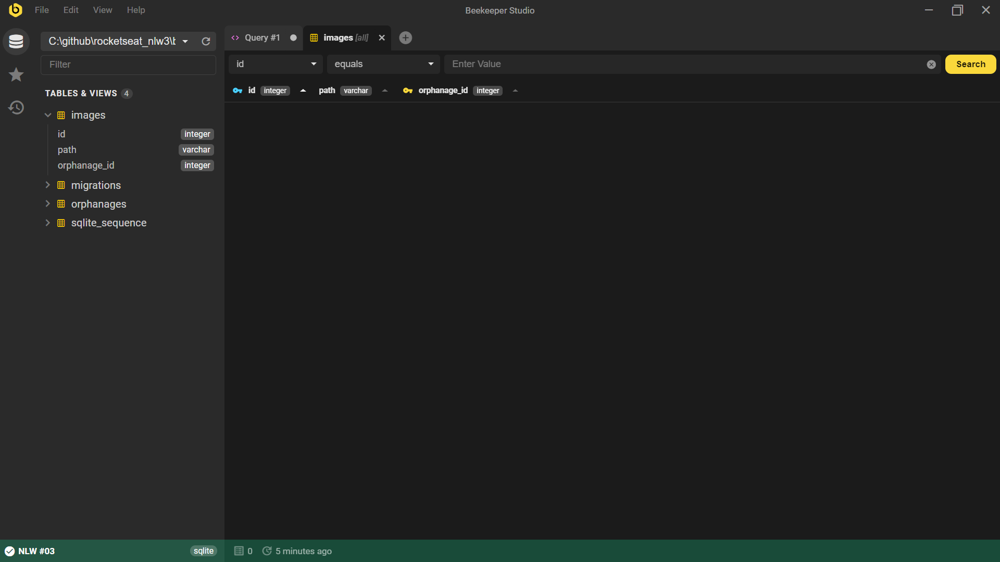

<!-- [](https://gitpod.io/#https://github.com/marcelosperalta/mock-up_e-learning_platform) -->

# "Happy" - Orphanage finder  

A platform to find orphanages to visit built with **[HTML](https://whatwg.org/)**, **[CSS](https://www.w3.org/Style/CSS/)**, **[JavaScript](https://developer.mozilla.org/en-US/docs/Web/JavaScript)**, **[TypeScript](https://www.typescriptlang.org/)**, **[React](https://reactjs.org/)**, **[Node.js](https://nodejs.org/)**, **[Express.js](https://expressjs.com/)**, and **[SQLite](https://www.sqlite.org/)**.  

<br>

<div align="center">
    
    
    &nbsp;
    
    &nbsp;
    &nbsp;
    
    &nbsp;
    
    &nbsp;
    
    &nbsp;
    
        &nbsp;
    
</div>

<br>

## :mortar_board: **_bootcamp:_**  

### [Rocketseat](https://rocketseat.com.br/)

#### [Next Level Week #3](https://nextlevelweek.com/)

*OmniStack* with [Diego Fernandes](https://github.com/diego3g)  


<br>

## :camera: **_screenshots:_**  

### :computer:  

  

  

### :iphone:  

soon...  
<br>
<!--    -->

## :fire: **_source code editor_**  

[Visual Studio Code](https://code.visualstudio.com/)  
<br>

## :wrench: **_front-end tools:_**  

[Figma](https://www.figma.com/)  

[React Icons](https://react-icons.github.io/react-icons/)  

[React Router](https://reactrouter.com/web/guides/quick-start)  

[Leaflet](https://leafletjs.com/)  

[React Leaflet](https://react-leaflet.js.org/)  

[OpenStreetMap](https://www.openstreetmap.org/)  

[mapbox](https://www.mapbox.com/)  

[Google Maps Platform](https://cloud.google.com/maps-platform)  
<br>

## :hammer: **_back-end tools:_**  

[Node.js](https://nodejs.org/en/)  

[npm](https://docs.npmjs.com/)  

[yarn](https://yarnpkg.com/)  

[Expo CLI](https://docs.expo.io/workflow/expo-cli/?redirected)  

[Express](https://expressjs.com/)  

[Chrome Extension "JSON Viewer"](https://chrome.google.com/webstore/detail/json-viewer/gbmdgpbipfallnflgajpaliibnhdgobh)  

[Insomnia](https://insomnia.rest/)  

[TypeORM](https://typeorm.io/)  

[SQLite](https://www.sqlite.org/)  

[Beekeeper Studio](https://www.beekeeperstudio.io/)  

[multer](https://www.npmjs.com/package/multer)  

[ExpressJS Async Errors](https://www.npmjs.com/package/express-async-errors)  

[Yup](https://www.npmjs.com/package/yup)  

[cors](https://www.npmjs.com/package/cors)  

[axios](https://github.com/axios/axios)  
<br>
<!-- [Visual Studio Code Extension "SQLite"](https://marketplace.visualstudio.com/items?itemName=alexcvzz.vscode-sqlite)   -->

<!-- [Express.js](https://expressjs.com/)  

[Nunjucks](https://mozilla.github.io/nunjucks/)  

[Git Bash](https://gitforwindows.org/)   -->

## :books: **_important topics:_**  

### front-end

[Representational state transfer (REST)](https://en.wikipedia.org/wiki/Representational_state_transfer)  

[JSON](https://www.json.org/)  

[Observer pattern](https://en.wikipedia.org/wiki/Observer_pattern#Uncoupled)  

[Single-page application (SPA)](https://en.wikipedia.org/wiki/Single-page_application)  

[Hot Reloading](https://reactnative.dev/blog/2016/03/24/introducing-hot-reloading.html#hot-reloading)  

[Fast Refresh](https://reactnative.dev/docs/fast-refresh)  

[React Hooks](https://reactjs.org/docs/hooks-intro.html)  

### back-end

[HTTP request methods](https://developer.mozilla.org/en-US/docs/Web/HTTP/Methods)  

[Query string](https://en.wikipedia.org/wiki/Query_string)  

[Object–relational mapping (ORM)](https://en.wikipedia.org/wiki/Object%E2%80%93relational_mapping)  

[Schema migration (also database migration)](https://en.wikipedia.org/wiki/Schema_migration)  

[Decorator pattern](https://en.wikipedia.org/wiki/Decorator_pattern)  

[Repository pattern](https://docs.microsoft.com/en-us/dotnet/architecture/microservices/microservice-ddd-cqrs-patterns/infrastructure-persistence-layer-design#:~:text=of%20Work%20patterns.-,The%20Repository%20pattern,from%20the%20domain%20model%20layer.)  

[Model–view–controller (MVC)](https://en.wikipedia.org/wiki/Model%E2%80%93view%E2%80%93controller)  

[Gerenciando variáveis ambiente no NodeJS](https://blog.rocketseat.com.br/variaveis-ambiente-nodejs/)  

### mobile

#### _Traditional_

[iOS](https://www.apple.com/ios/)  

- [Objective-C](https://developer.apple.com/library/archive/documentation/Cocoa/Conceptual/ProgrammingWithObjectiveC/Introduction/Introduction.html)  

- [Swift](https://developer.apple.com/swift/)  

[Android](https://www.android.com/)  

- [Java](https://www.java.com)  

- [Kotlin](https://developer.android.com/kotlin)  

#### _Multiplataform_

[React Native](https://reactnative.dev/)  

[Flutter](https://flutter.dev/)  

[NativeScript](https://nativescript.org/)  

### JavaScript transcompiler

[Babel](https://babeljs.io/)  

### JavaScript module bundler

[webpack](webpack.js.org)  

<br>

## :arrow_forward: **_start:_**  

### :full_moon: front-end ("web" folder)

:black_medium_small_square: **_creat react project adding typescript from terminal:_**  

```
yarn create react-app web --template typescript
```

or  

```
npx create-react-app web --template typescript
```

:black_medium_small_square: **_open the project from terminal:_**  

```
cd web
```

```
code .
```

:black_medium_small_square: **_run the project from terminal:_**  

```
yarn start
```

or  

```
npm start
```

:black_medium_small_square: **_install react icons:_**  

```
yarn add react-icons
```

or  

```
npm install react-icons
```

:black_medium_small_square: **_install react router:_**  

```
yarn add react-router-dom
yarn add @types/react-router-dom -D
```

or  

```
npm install react-router-dom
npm install @types/react-router-dom -D
```

:black_medium_small_square: **_install leaflet and react-leaflet:_**  

```
yarn add leaflet react-leaflet
yarn add @types/react-leaflet -D
```

### :new_moon: back-end ("backend" folder)

:black_medium_small_square: **_create ```backend``` folder from terminal:_**  

```
mkdir backend
```

```
cd backend
```

:black_medium_small_square: **_create ```package.json``` file from terminal:_**  

```
yarn init -y
```

:black_medium_small_square: **_install Express:_**  

```
yarn add express
yarn add @types/express -D
```

:black_medium_small_square: **_add Typescript:_**  

```
yarn add typescript -D
```

```
yarn tsc --init
```

:black_medium_small_square: **_change ```tsconfig.json```:_**  

```
"target": "es2017",
```

:black_medium_small_square: **_install ts-node-dev:_**  

```
yarn add ts-node-dev -D
```

:black_medium_small_square: **_add to ```package.json```:_**  

```
  "scripts": {
    "dev": "ts-node-dev --transpile-only --ignore-watch node_modules src/server.ts"
  },
```

:black_medium_small_square: **_run the project from terminal:_**  

```
yarn dev
```

_to confirm if is running:_

```
localhost:3333
```

:black_medium_small_square: **_install Insomnia Core:_**  

[Insomnia Core](https://insomnia.rest/download)  

  

:black_medium_small_square: **_install TypeORM and SQLite:_**  

```
yarn add typeorm sqlite3
```

create a ```database``` folder inside ```src``` folder  

create a ```database.sqlite``` file inside ```database``` folder  

create an ```ormconfig.json``` file inside ```backend``` folder and copy the text below:  

```
{
    "type": "sqlite",
    "database": "./src/database/database.sqlite"
}
```

create a ```connection.ts``` file inside ```database``` folder  

create a ```migrations``` folder inside ```database``` folder  

:black_medium_small_square: **_configure TypeORM to work with TypeScript:_**  

add to ```package.json``` file on "scripts" the text below:  

```
{
    "typeorm": "ts-node-dev ./node_modules/typeorm/cli.js"
}
```

and run TypeORM:  

```
yarn typeorm
```

now the commands will be like that:  

```
cli.js schema:sync
cls.js schema:log
etc.
```

:black_medium_small_square: **_configuration to enable database migration:_**  

add to ```ormconfig.json``` the text below:  

```
    "migrations": [
        "./src/database/migrations/*.ts"
    ],
    "cli": {
        "migrationsDir": "./src/database/migrations"
    }
```

create the migration ```create_orphanages```:  

```
yarn typeorm migration:create -n create_orphanages
```

create tables using the database migration method and TypeORM:  

```
yarn typeorm migration:run
```

view the database created:  

[Beekeeper Studio](https://www.beekeeperstudio.io/)  

  

create a ```models``` folder (is a representation of each database table as a class)  

create a model ```Orphanage.ts``` file inside ```models``` folder  

:rotating_light: **_reverting the process in migration to add "opening_hours" field:_**  

```
yarn typeorm migration:revert
```

add to the file ```<timestamp>-create_orphanages.ts``` inside ```migrations``` folder the text below between the fileds "instructions" and "open_on_weekends":  

```
                {
                    name: 'opening_hours',
                    type: 'varchar'
                },
```

create the table again using the database migration method and TypeORM:  

```
yarn typeorm migration:run
```

:black_medium_small_square: **_enable and configure the ```tsconfig.json``` file property below:_**  

```
"strictPropertyInitialization": false,
```

:black_medium_small_square: **_enable the ```tsconfig.json``` file properties below:_**  

```
"experimentalDecorators": true,
"emitDecoratorMetadata": true,
```

:black_medium_small_square: **_how to populate the orphanages' database:_**  

start the app (```backend``` folder)  

_(on Windows: ```C:\...\backend>```)_  
```
 yarn dev
```
_result:_  

  

open Insominia  

use the method POST with the URL below:  

http://localhost:3333/orphanages  

configure the body with the information like the example below and press "Send"  

```
{	
	"name": "Jewish Orphanage Berlin-Pankow",
	"latitude": 52.5685795,
	"longitude": 13.4101369,
	"about": "Sobre o orfanato",
	"instructions": "Venha visitar",
	"opening_hours": "Das 8h até as 18h",
	"open_on_weekends": true
}
```

_result:_

  

  

:black_medium_small_square: **_add to ```ormconfig.json```:_**  

```
    "entities": [
        "./src/models/*.ts"
    ],
```

open Insominia again  

use the method POST with the URL below:  

http://localhost:3333/orphanages  

configure the body with the information like the example below and press "Send"  

```
{	
	"name": "Jewish Orphanage Berlin-Pankow",
	"latitude": 52.5685795,
	"longitude": 13.4101369,
	"about": "Sobre o orfanato",
	"instructions": "Venha visitar",
	"opening_hours": "Das 8h até as 18h",
	"open_on_weekends": true
}
```

_result:_

  

  

:black_medium_small_square: **_how to list the orphanages' database:_**  

open Insominia again  

use the method GET with the URL below and press "Send":  

http://localhost:3333/orphanages  

_result:_

  

:black_medium_small_square: **_how to list on orphanate from orphanages' database:_**  

open Insominia again  

use the method GET with the URL below and press "Send":  

http://localhost:3333/orphanages/id

e.g.

http://localhost:3333/orphanages/1  

_result:_

  

:black_medium_small_square: **_create a new table using the database migration method and TypeORM:_**  

! _a table to store the name of the orphanages photos' files_  

```
yarn typeorm migration:create -n create_images
```

_result:_

  

configure the new migration file (```xxxxxxxxxxxxx-create_images.ts```) and run  

```
yarn typeorm migration:run
```

_result:_

  

  

:black_medium_small_square: **_install a library to work with file upload:_**  

```
yarn add multer
yarn add @types/multer -D
```

inside the path ```...\backend\src```, create ```config``` folder with ```upload.ts``` file inside  

inside the path ```...\backend```, create ```uploads``` folder  

:rotating_light: When you are using Insomnia and want to make tests uploading images, select the "Multipart" option in the "Body" like the example below.  

  

  

  

  

  

  

inside the path ```...\backend\src```, create ```views``` folder with ```orphanages_view.ts``` file inside  

:rotating_light: With the views you can, for example, return a user registered on DB without showing the password.  

create ```images_view.ts``` file inside the ```views``` folder  

  

  

:black_medium_small_square: **_handling exceptions:_**  

```
yarn add express-async-errors  
```

inside the path ```...\backend\src```, create ```errors``` folder with ```handler.ts``` file inside  

  

  

:black_medium_small_square: **_install yup:_**  

```
yarn add yup
yarn add @types/yup -D
```
_before import "ValidationError" from yup:_  

  

_after import "ValidationError" from yup:_  

  

  

:black_medium_small_square: **_install cors:_**  

```
yarn add cors
yarn add @types/cors -D
```

:black_medium_small_square: **_delete all database using Beekeeper Studio:_**  

  

  

  

  

:black_medium_small_square: **_create one Orphanage using Insomnia:_**  

  

  

  

### :full_moon: front-end ("web" folder)

:black_medium_small_square: **_connecting the front-end to the back-end using [axios](https://github.com/axios/axios):_**  

_note:_ alternatively you can use the [```fetch()```](https://developer.mozilla.org/en-US/docs/Web/API/Fetch_API) method  

_install axios from web folder:_  

```
yarn add axios
yarn add @types/axios -D
```

inside the path ```...\web\src```, create ```services``` folder with ```api.ts``` file inside  

<!-- ## :dvd: **_install package.json dependencies:_**

on bash / terminal  
```
npm install
```
<br>

## :runner: **_run the project:_**  

on bash / terminal  
```
npm run dev
```

on browser  

http://127.0.0.1:5500/

or

http://localhost:5500/

<br>

## :green_book: **_concepts:_**  

[Responsive web design (Mobile First...)](https://en.wikipedia.org/wiki/Responsive_web_design)  

[What is Mobile First Design? Why It’s Important & How To Make It?](https://medium.com/@Vincentxia77/what-is-mobile-first-design-why-its-important-how-to-make-it-7d3cf2e29d00)  

[Template Engine](https://en.wikipedia.org/wiki/Template_processor)  
<br>

## :blue_book: **_references:_**  

[How to Write an Awesome GitHub README](https://healeycodes.com/github/beginners/tutorial/productivity/2019/04/14/writing-an-awesome-github-readme.html)  

[EMOJI CHEAT SHEET](https://www.webfx.com/tools/emoji-cheat-sheet/)   -->