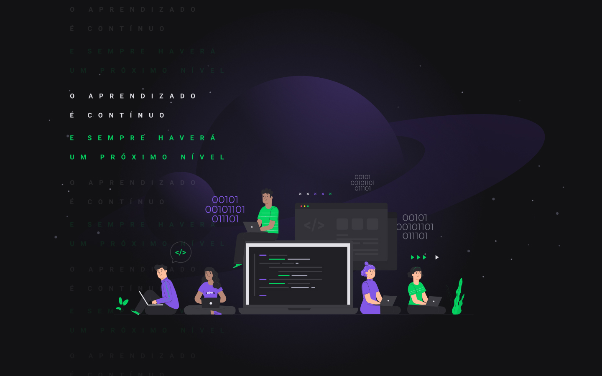

<!-- [](https://gitpod.io/#https://github.com/marcelosperalta/mock-up_e-learning_platform) -->

# "Happy" - Orphanage finder  

A platform to find orphanages to visit built with **[HTML](https://whatwg.org/)**, **[CSS](https://www.w3.org/Style/CSS/)**, **[JavaScript](https://developer.mozilla.org/en-US/docs/Web/JavaScript)**, **[TypeScript](https://www.typescriptlang.org/)**, **[React](https://reactjs.org/)**, **[Node.js](https://nodejs.org/)**, **[Express.js](https://expressjs.com/)**, and **[SQLite](https://www.sqlite.org/)**.  

<br>

<div align="center">


&nbsp;

&nbsp;
&nbsp;

&nbsp;

&nbsp;

&nbsp;

&nbsp;
&nbsp;

</div>

<br>

## :mortar_board: **_bootcamp:_**  

### [Rocketseat](https://rocketseat.com.br/)

#### [Next Level Week #3](https://nextlevelweek.com/)

*OmniStack* with [Diego Fernandes](https://github.com/diego3g)  


<br>

## :camera: **_screenshots:_**  

### :iphone:  

  

### :computer:  

  

  

  
<br>

## :fire: **_Source code editor_**  

[Visual Studio Code](https://code.visualstudio.com/)  
<br>

## :wrench: **_tools "Front-end":_**  

<!-- [Microsoft Edge](https://www.microsoft.com/en-us/edge)  

[Google Chrome](https://www.google.com/chrome/)   -->

<!-- [Visual Studio Code Extension "Live Server"](https://marketplace.visualstudio.com/items?itemName=ritwickdey.LiveServer)  

[Visual Studio Code Extension "Launchbase Theme"](https://marketplace.visualstudio.com/items?itemName=maykbrito.theme-launchbase)   -->

[Figma](https://www.figma.com/)  
<br>

## :hammer: **_tools "Back-end":_**  

[Node.js](https://nodejs.org/en/)  

[npm](https://docs.npmjs.com/)  

[yarn](https://yarnpkg.com/)  

[Expo CLI](https://docs.expo.io/workflow/expo-cli/?redirected)  
<br>
<!-- [Visual Studio Code Extension "SQLite"](https://marketplace.visualstudio.com/items?itemName=alexcvzz.vscode-sqlite)   -->

<!-- [Express.js](https://expressjs.com/)  

[Nunjucks](https://mozilla.github.io/nunjucks/)  

[SQLite](https://www.sqlite.org/)  

[Git Bash](https://gitforwindows.org/)   -->

## :books: **_important topics:_**  

[Representational state transfer (REST)](https://en.wikipedia.org/wiki/Representational_state_transfer)  

[JSON](https://www.json.org/)  

[Observer pattern](https://en.wikipedia.org/wiki/Observer_pattern#Uncoupled)  

[Single-page application (SPA)](https://en.wikipedia.org/wiki/Single-page_application)  

<!-- ## :dvd: **_install package.json dependencies:_**

on bash / terminal  
```
npm install
```
<br>

## :runner: **_run the project:_**  

on bash / terminal  
```
npm run dev
```

on browser  

http://127.0.0.1:5500/

or

http://localhost:5500/

<br>

## :green_book: **_concepts:_**  

[Responsive web design (Mobile First...)](https://en.wikipedia.org/wiki/Responsive_web_design)  

[What is Mobile First Design? Why It’s Important & How To Make It?](https://medium.com/@Vincentxia77/what-is-mobile-first-design-why-its-important-how-to-make-it-7d3cf2e29d00)  

[Template Engine](https://en.wikipedia.org/wiki/Template_processor)  
<br>

## :blue_book: **_references:_**  

[How to Write an Awesome GitHub README](https://healeycodes.com/github/beginners/tutorial/productivity/2019/04/14/writing-an-awesome-github-readme.html)  

[EMOJI CHEAT SHEET](https://www.webfx.com/tools/emoji-cheat-sheet/)   -->
